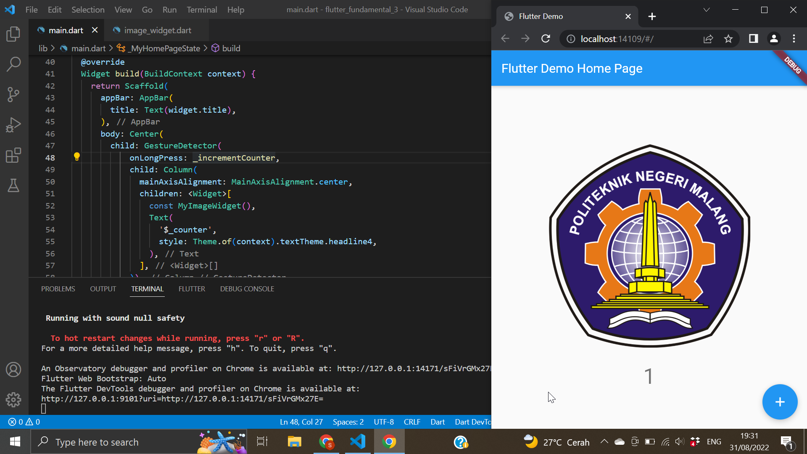

# flutter_fundamental_3

A new Flutter module project.

## Praktikum 1

### 1. onTap
Saat menggunakan onTap maka counter akan bertambah setiap kali klik gambar

### 2. onDoubleTap
Saat menggunakan onDoubleTap maka counter akan bertambah setiap kali klik dua kali pada gambar

### 3. onLongPress
Saat menggunakan onDoubleTap maka counter akan bertambah setiap kali klik lama pada gambar
